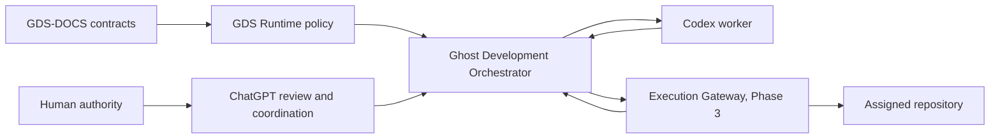

# Ghost Development Orchestrator Architecture

## System context

Ghost Development Orchestrator (GDO) is an independent, local-first Policy
Consumer and durable operational state owner. GDS-DOCS supplies canonical
contracts; GDS Runtime supplies deterministic policy decisions; humans supply
authority; workers and gateways produce evidence. Product repositories do not
depend on GDO at runtime.



## Component model

| Component | Owns | Does not own |
|---|---|---|
| Local Control Surface | registration, status, operator commands | policy meaning, effects |
| Artifact Exchange | immutable package storage and acknowledgement | approval invention |
| Metadata Index | identities, digests, relationships, retention metadata | canonical payload meaning |
| Event Queue | durable inbox/outbox, lease, retry, replay | governance truth |
| Orchestrator | admission, workflow and recovery coordination | credential material |
| Worker Adapter | scoped launch and evidence return | unrestricted repository access |
| Audit Log | append-only security/authority/effect observations | secrets or full prohibited payloads |
| MCP Adapter | optional protocol transport | queue truth or recovery ownership |
| Execution Gateway | Phase 3 typed approved effects | general shell or policy decisions |
| Credential Broker Adapter | Phase 3 opaque scoped credential access | credential serialization |

## Process and deployment model

Phase 1 packages Control Surface, Artifact Exchange, Metadata Index, Orchestrator,
Worker Adapter, and Audit into one manually launched local application. Boundaries
remain logical and testable. The Gateway and credential adapter become a separate
least-privilege process in Phase 3. The concrete storage/queue engine is a later
decision; Artifact, Event, Metadata, and Audit may share an engine initially but
must retain separate schemas, append/immutability rules, and access paths.

## Data flow

1. A human-approved Q and Approval Reference become an Execution Package.
2. GDS Runtime validates policy; GDO validates contract, identity, and admission.
3. GDO durably stores package and event before acknowledgement.
4. A Worker Adapter launches a scoped Codex attempt manually in Phase 1.
5. Codex returns a Completion Package; GDO validates, deduplicates, and audits it.
6. In Phase 3 only, a separately approved Effect Request reaches the Gateway.
7. The Gateway checks preconditions, performs one typed effect, and stores/returns
   an immutable receipt. Retry starts with receipt lookup.

## Control flow and authority

Operational state cannot promote itself into approval. ChatGPT may review,
recommend, and coordinate; Codex may implement/validate within package authority;
GDS Runtime classifies; GDO admits and coordinates; Gateway executes. Commit,
push, tag creation, tag push, and release remain separate approval units.

## Storage requirements

- Local-first, durable, restart-safe, and backup/restoration testable
- Immutable artifact versions with SHA-256/JCS integrity
- Metadata index separated conceptually from payload/blob storage
- Durable inbox/outbox, ack after persistence, replay cursor, leases/heartbeat,
  retry budget/backoff, per-correlation ordering, dead-letter disposition
- Append-only attempt, receipt, and authority audit evidence from Phase 1
- Retention enforcement, redaction derivatives, secret quarantine
- Future external immutable blob reference with digest and size

The exact database/queue technology is deferred to bootstrap or an implementation
decision. A database-backed queue is acceptable only after atomic inbox/outbox,
lease, replay, and corruption-recovery tests.

## Trust and security boundaries

Untrusted inputs include prompts, Q payloads, artifacts, repository contents, and
adapter messages. They are data, never executable authority. Repository identity
comes from Registry plus verified root/remote/branch evidence. Credentials remain
outside artifacts and are acquired only by the Gateway for the approved operation.
Local single-user deployment reduces tenancy complexity but does not trust local
malware, compromised files, stale sessions, or tampered queues.

## Failure and recovery boundaries

GDO owns retry, cancellation, timeout, dead letter, restart recovery, and operator
runbooks. GDS defines allowed recovery constraints. Worker Adapter reports retry
safety. Attempts remain immutable. SCW means governance evidence/human decision
is needed; dead letter means poison/exhausted operational delivery. MCP failure
never changes queue truth.

## Dependency direction

```text
GDO -> pinned GDS contracts and GDS Runtime policy interface
GDS Runtime -/-> GDO
GameGhost -/-> GDO
GDO -/-> GameGhost unless an approved Q assigns it as target
```

## MVP phases

- Phase 0: contracts, Proposed ADR, architecture, threat-model draft.
- Phase 1: durable artifact exchange, manual approved registration and Codex
  launch, completion return, acknowledgement, audit, duplicate detection,
  append-only receipts/attempts, restart safety. No Gateway or MCP dependency.
- Phase 2: durable event-driven queue, automated worker launch, leases, retry,
  recovery, dead letter/SCW status, optional MCP adapter.
- Phase 3: separate reviewed Commit/Push Gateway with scoped credentials.
- Phase 4: advanced recovery, cross-session project state, tag recommendation and
  separately approved tag effects.

## Non-goals

Automatic architecture/Q approval, unrestricted shell, force push, secret
storage, GameGhost dependency, cloud/Docker/remote workers, multi-user tenancy,
self-modifying policy, shared schema repository, Windows Service, and full UI are
not initial goals.
