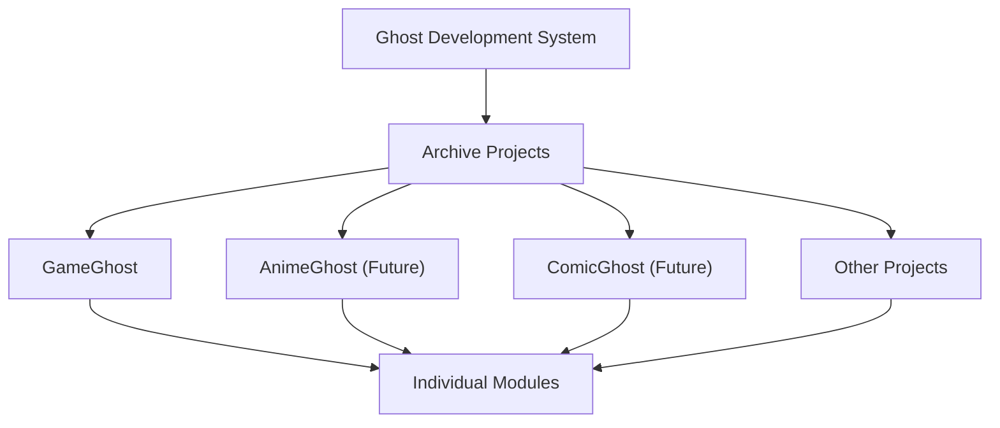

# Responsibility Boundary

## Purpose

This document defines the main ownership boundaries in the Ghost Development
System.

Clear boundaries help humans and AI decide where a feature, document, workflow,
or future candidate belongs.

## DevelopmentSystem

DevelopmentSystem owns archive-wide development infrastructure.

Responsibilities:

- Workflow.
- Queue.
- Review.
- Documentation.
- Templates.
- Project Profiles.
- AI Startup Procedure.
- Startup Checklist.
- Repository Root Validation.
- AI Proactive Proposal.
- Collaborative Decision.
- Completion Checklist.
- Output Layer.
- Debug Artifact Review.
- Debug Escalation Ladder.
- Migration First Boundary.
- Knowledge Asset Layer.
- Metrics Layer.
- PIP.
- Database Utility Framework.
- Release Coordination.
- Backup Coordination.
- Archive Target Registry.
- Health.
- Command Center.
- DMS.

DevelopmentSystem does not own module-specific business logic, module schema
content, or module import rules.

DevelopmentSystem is the parent development foundation for multiple projects.
It may define shared workflow, documentation, rules, templates, AI
collaboration, and cross-project coordination. It must not silently take over a
child project's runtime responsibilities.

## Project Profiles

Project Profiles own the documentation boundary between GDS shared operating
rules and project-specific operating context.

Responsibilities:

- record project-specific repository location and edit boundary;
- record backup / reference-only policy;
- record project-specific Q expectations;
- record project-specific rules, workflow, AI context, and completion policy;
- help AI read the right context before a project-specific Q;
- keep child project runtime ownership separate from GDS shared rules.

Project Profiles do not own:

- project runtime implementation;
- project schema;
- project data;
- project release approval;
- project-specific business logic;
- final human approval authority.

Architecture flow:

```text
GDS Shared Rules
  -> Project Profile
  -> Q File
  -> Startup Checklist
  -> Implementation / Review
```

## AI Startup Procedure

AI Startup Procedure owns the pre-checklist reading order before AI starts
implementation, review, documentation update, or Q execution.

Responsibilities:

- start from AI Repository Index when public GDS knowledge is needed;
- validate the actual repository root before editing;
- confirm GDS Core Rules / Workflow before project-specific work;
- read the Target Project Profile before the Current Q File when one exists;
- confirm the Current Q File and authoritative artifact path;
- pass the confirmed context into Startup Checklist;
- stop when repository, project, profile, Q, scope, or commit policy is unclear.

AI Startup Procedure does not own:

- final human approval authority;
- official rule definitions;
- project runtime behavior;
- commit, tag, or release approval;
- replacing the Q File or Startup Checklist.

Architecture flow:

```text
AI Repository Index
  -> Repository Root Validation
  -> GDS Core Rules / Workflow
  -> Target Project Profile
  -> Current Q File
  -> Startup Checklist
  -> Scope / Out of Scope
  -> Implementation / Review
```

## Startup Checklist

Startup Checklist owns the session-start confirmation boundary before
implementation, review, Q execution, or documentation update begins.

Responsibilities:

- confirm Working Repository, Single Source Of Truth, and Related Repository
  edit authority;
- confirm Production / Backup / Reference Only boundaries;
- confirm Current Phase and Current Goal;
- confirm applicable rules and methodologies;
- confirm Q Artifact / Download File status before execution;
- confirm Scope / Out of Scope before edits;
- confirm dirty workspace state and commit policy before staging or commit.

Startup Checklist does not own:

- final human approval authority;
- official rule definitions;
- workflow definitions after startup;
- project-specific runtime behavior;
- Git commit approval;
- Knowledge Asset approval.

Architecture flow:

```text
Start
  -> Startup Checklist
  -> Repository / Rule / Methodology / Scope Confirmation
  -> Implementation / Review
```

## Repository Root Validation

Repository Root Validation owns the boundary between declared Working Repository
and the actual Git repository root used by shell commands.

Responsibilities:

- confirm current working directory;
- confirm `git rev-parse --show-toplevel`;
- compare actual Git root with the Q Working Repository;
- distinguish production repository from backup or reference-only repository;
- prevent implementation, review, commit, tag, or release work from starting in
  the wrong repository.

Repository Root Validation does not own:

- repository migration;
- Git history rewrite;
- final commit approval;
- project-specific runtime behavior.

## AI Proactive Proposal

AI Proactive Proposal owns the collaboration boundary where AI may raise
evidence-based improvements, time savings, conflicts, risks, and knowledge
opportunities without silently changing implementation.

Responsibilities:

- identify better technical approaches;
- identify significant time saving opportunities;
- identify repository, scope, rule, or methodology conflicts;
- identify maintenance risks;
- identify Concept / CASE / Rule / Workflow candidates;
- separate proposal from implementation;
- leave final decision to the user.

AI Proactive Proposal does not own:

- final human approval authority;
- scope expansion;
- commit, tag, or release approval;
- automatic implementation changes;
- promotion of Future Candidates into approved scope.

## Collaborative Decision

Collaborative Decision owns the discussion and classification boundary where AI
proposals and user proposals become reviewed decisions and documentation
targets.

Responsibilities:

- separate AI Proposal and User Proposal;
- support discussion without treating disagreement as failure;
- require evidence review before durable classification;
- review whether knowledge belongs in Rule, Workflow, Methodology, CASE,
  Concept, Template, Example, Glossary, Architecture, PIP Decision History,
  Future Candidate, or no durable document;
- document the decision, rationale, documentation target, and follow-up Q when
  needed.

Collaborative Decision does not own:

- final human approval authority;
- automatic rule promotion;
- automatic workflow standardization;
- release approval;
- implementation approval beyond the accepted Q scope.

## Completion Checklist

Completion Checklist owns the task-end confirmation boundary before work is
treated as complete, committed, tagged, released, or handed off to the next Q.

Responsibilities:

- confirm verification result and unverified items;
- confirm review result and Human Approval Gate needs;
- confirm completion report status;
- confirm Improvement Review status;
- confirm commit requirement and commit execution separately;
- confirm tag requirement and tag execution separately;
- confirm release requirement and release publication separately;
- confirm Recommended Next Q;
- confirm workspace clean state or remaining dirty workspace state.

Completion Checklist does not own:

- final human approval authority;
- commit approval;
- tag approval;
- release approval;
- project-specific release policy;
- verification implementation;
- cleanup of unrelated workspace changes.

Architecture flow:

```text
Implementation
  -> Verification / Review / Completion Report
  -> Completion Checklist
  -> Commit / Tag / Release Decision
  -> Recommended Next Q
  -> End
```

## Output Layer

Output Layer owns the durable boundary between temporary chat communication and
managed artifacts.

Output Layer responsibilities:

- classify output as Chat or Artifact before implementation or review;
- make reusable Q files, design documents, specifications, review requests,
  AI requests, roadmap proposals, and human approval packets file-based by
  default;
- route Q file artifacts and completion report artifacts to Task Artifact
  Workspaces under `docs/requests/`;
- use Markdown `.md` as the standard Git and AI handoff format;
- use Word `.docx` when human review, comments, approval, redline, or offline
  reading is expected;
- keep chat responses limited to summary, artifact links or paths,
  verification notes, and remaining issues when an artifact is authoritative;
- reduce copy mistakes, truncated prompts, broken Markdown, and incomplete AI
  input;
- support Human Approval Gate by preserving complete approval context;
- support Knowledge Promotion by making reusable outputs easy to store,
  review, diff, and promote.

Output Layer does not own:

- final human approval authority;
- project-specific runtime artifacts;
- Knowledge Asset definitions;
- Metrics interpretation;
- Git commit approval.

Architecture flow:

```text
Idea / Request
  -> Output Layer
  -> Q Artifact Workspace
  -> Approval
  -> Codex / AI Implementation
  -> Completion Report Artifact
  -> Human Review
  -> Commit / Knowledge Promotion
  -> Archive
```

## Debug Artifact Review

Debug Artifact Review owns the development-time evidence boundary for uncertain
AI, OCR, recommendation, auto-detection, candidate extraction, fuzzy matching,
and visual processing work.

Responsibilities:

- decide whether Debug Mode applies before final judgment;
- generate inspectable intermediate artifacts during development;
- require expected normal state and review viewpoints;
- support future AI review handoff by naming the artifacts and questions;
- keep normal execution free from debug artifact generation unless Debug Mode
  is explicitly requested;
- keep debug artifacts out of Git unless a Q explicitly promotes them to
  documentation, golden samples, fixtures, or approved review evidence.

Debug Artifact Review does not own:

- final human approval authority;
- project-specific runtime behavior;
- Git promotion decisions;
- Knowledge Asset approval;
- production output contracts.

Architecture flow:

```text
Issue / Idea
  -> Debug Mode Decision
  -> Intermediate Artifact Generation
  -> Visual / Intermediate Review
  -> Expected State Check
  -> Design Review, when needed
  -> Fix Q Draft or Implementation
```

## Debug Escalation Ladder

Debug Escalation Ladder owns the escalation order for uncertain defects and
quality issues before algorithm change.

Responsibilities:

- require phenomenon check before metric-only judgment;
- treat metrics as evidence input, not final authority;
- require human review before expanding debug artifacts for visual or approval
  sensitive problems;
- escalate to Debug Artifact Review when intermediate behavior must be
  inspected;
- require pipeline trace before parameter tuning or algorithm change in complex
  debugging;
- require first broken step before root cause confirmation;
- keep algorithm change as the final stage after evidence, trace, and root
  cause are reviewed.

Debug Escalation Ladder does not own:

- debug artifact storage policy;
- project-specific runtime implementation;
- final human approval authority;
- production adoption;
- Git commit approval.

Architecture flow:

```text
Phenomenon Check
  -> Metrics Check
  -> Human Review
  -> Debug Artifact Generation
  -> Pipeline Trace
  -> First Broken Step Identification
  -> Root Cause Confirmation
  -> Algorithm Change
```

## Migration First Boundary

Migration First Boundary owns the distinction between internal structures that
should migrate to a new standard and public compatibility contracts that must
remain stable.

Responsibilities:

- define the new internal standard before changing structure;
- require Migration Plan, Reference Update, Verification, and Legacy Removal
  for internal architecture changes;
- limit Public Compatibility to public release, public API / CLI, documented
  external workflow, exported artifact schema, DB schema, and user-facing data
  format;
- prevent permanent fallback for internal folder structure, script layout,
  adapter internal interface, prototype scripts, shared utility location,
  artifact workspace layout, queue / request internal structure, and future
  GhostCore / GDS internal modules;
- record Remaining Legacy, removal conditions, follow-up Q, and restore /
  rollback guidance when temporary fallback remains.

Migration First Boundary does not own:

- final human approval authority;
- runtime implementation;
- project-specific public release decisions;
- DB schema ownership for archive modules;
- external user support policy.

Architecture flow:

```text
Internal Architecture Change
  -> New Standard
  -> Migration Plan
  -> Reference Update
  -> Verification
  -> Legacy Removal
  -> Completion Report
```

## Knowledge Asset Layer

Knowledge Asset Layer (KAL) owns the shared knowledge asset boundary for Ghost
series projects.

KAL responsibilities:

- define common Knowledge Asset categories;
- provide shared promotion, validation, registry, and search direction;
- separate approved knowledge from raw runtime data;
- make automation consume explicit reviewed knowledge;
- support GameGhost, AnimeGhost, ComicGhost, and future projects without taking
  over their runtime ownership.

Knowledge Asset examples:

- Approved Alias.
- Metadata.
- Unicode Rules.
- Golden Samples.
- OCR Confusion Rules.
- Review Decisions.
- Series Rules.
- Platform Rules.
- User Overrides.
- Future AI Knowledge.

KAL does not own:

- module-specific schema definitions;
- module-specific import rules;
- project-specific runtime business logic;
- final human approval authority.

Architecture flow:

```text
OCR / Import / Review Input
  -> Knowledge Asset Layer
  -> Candidate Engine
  -> Review GUI / Knowledge Editor
  -> Human Approval
  -> Knowledge Growth
```

Knowledge Editor is the editing surface for Knowledge Assets. Knowledge Assets
Dashboard is the observation surface for asset state, growth, and quality.
Neither one replaces KAL itself.

## Metrics Layer

Metrics Layer owns the shared measurement boundary for Ghost Development
System.

Purpose:

```text
Field Project
  -> Metrics Collection
  -> Knowledge
  -> Evidence
  -> Ghost Development System
```

Metrics Layer responsibilities:

- define common metric categories and meanings;
- connect metrics to reviewed artifacts, Q files, completion reports, and
  Knowledge Assets;
- separate raw operational logs from reviewed evidence;
- support Evidence Feedback Loop without bypassing Human Approval Gate;
- make Ghost Development System improvement measurable across field projects.

Metric examples:

- OCR Success Rate.
- OCR Review Rate.
- Alias Improvement.
- Unicode Improvement.
- Golden Sample Accuracy.
- Q Completion Time.
- Review Iterations.
- Duplicate Prevention.
- Documentation Reuse.
- Knowledge Promotion Count.
- Reused Knowledge Assets.
- New Knowledge Assets.
- Human Review Time.
- Automation Rate.

Metrics Layer does not own:

- project-specific runtime instrumentation;
- private operational data;
- final interpretation of quality;
- rule standardization approval;
- release decisions.

Metrics are evidence inputs. They do not automatically promote a rule,
workflow, architecture change, or automation behavior. Promotion still requires
review and, when needed, Human Approval Gate.

## Project Information Package

Project Information Package (PIP) は project briefing boundary を所有します。

PIP responsibilities:

- current project status を要約する。
- current priorities を要約する。
- なぜ project が現在の状態になっているかを説明する。
- source documents、Q artifacts、completion reports、roadmap direction を接続する。
- Improvement History と Decision History の summary を維持する。
- reusable improvement cases を Case Knowledge Base として整理する。
- standard tags と case index により、project、methodology、rule、lifecycle で検索できるようにする。
- AI collaboration と handoff を支える。
- Command Center の briefing source になる。
- next task と known issues を示す。

PIP does not own:

- official rule authority。
- workflow authority。
- architecture authority。
- roadmap approval。
- raw evidence。
- raw debug artifacts。
- runtime code。
- DB schema。
- Import / Apply behavior。
- Command Center implementation。
- final human approval authority。

Responsibility relationship:

```text
GitHub Docs
  -> PIP
  -> Q Artifact / Completion Report
  -> Information Package / Evidence
  -> Command Center briefing
```

Information Package は evidence-focused のまま維持します。PIP は briefing-focused
のまま維持します。GIP は future reviewed standard として予約し、独自の
specification が作られるまでは stable package として扱いません。

### PIP Case Knowledge Base Boundary

PIP Case Knowledge Base は、completion reports や field issues から得た reusable knowledge を要約し、証跡へリンクします。

It owns:

- `pip/cases/`
- `pip/rule_stories/`
- `pip/evolutions/`
- `pip/best_practices/`
- `pip/investigations/`
- `pip/concepts/`
- `pip/templates/`
- PIP Case metadata and tag consistency.
- Case Index searchability.
- Roadmap2 Knowledge Salvage classification outputs.

It does not own:

- official rule authority;
- workflow authority;
- raw evidence packages;
- task artifact workspaces;
- runtime implementation;
- final human approval.

Roadmap2 Knowledge Salvage is a PIP / workflow bridge. It classifies reusable
Roadmap2 knowledge into CASE, Best Practice, Evolution, Investigation, Rule
Story, Concept, rule update, workflow update, glossary update, architecture
boundary, or history entry. It does not approve new runtime features or replace
human review.

Concept Promotion owns the lifecycle decision for `pip/concepts/`: Candidate,
Under Review, Experiment, Validated, Promoted, or Archived. It does not approve
runtime implementation, rule standardization, architecture changes, or public
terminology by itself; those destinations still require the appropriate review
and Human Approval Gate.

## Project Hierarchy



Ghost Development System defines shared development infrastructure.

Archive Projects own project-specific direction and runtime behavior.

Individual Modules own module-specific business logic, schema, metadata, and
import rules.

## Gray Ghost Core

Gray Ghost Core owns:

- Analysis.
- Recommendation.
- Cross-module Intelligence.

Gray Ghost Core may compare modules, detect patterns, and recommend action. It
does not replace module ownership or human approval.

Gray Ghost Core may recommend Knowledge Assets or detect cross-project patterns,
but approved asset ownership and promotion rules remain under KAL and Human
Approval Gate.

## Archive Modules

Archive Modules own:

- Business Logic.
- Schema.
- Metadata.
- Import Rules.

Examples of Archive Modules may include GameGhost and future modules.

Module-specific behavior should stay in the module unless repeated use proves it
belongs in DevelopmentSystem or Gray Ghost Core.

Archive Modules may provide project-owned Knowledge Assets to KAL. For example,
GameGhost may own game-specific metadata or aliases, while KAL defines how those
assets are promoted, validated, searched, and reused by shared tooling.

Examples of future or related projects may include:

- GameGhost.
- AnimeGhost.
- ComicGhost.
- Other.

Each project should keep its own runtime ownership unless a later reviewed Q
promotes shared behavior into Ghost Development System.

## Launcher

Launcher owns:

- User Entry Point.

Launcher may route users to tools and archive targets. It should not own DMS,
workflow, module business logic, or database utility frameworks.

## Command Center

Command Center owns the operational entry point and repository orchestration
boundary for development work.

Command Center is not only an Auto Q Generator. It may scan repository
documents, assemble an Information Package, run or display repository health
signals, route users to review tools, and draft Q / review / completion /
registry update artifacts through approved templates.

Command Center may show Knowledge Assets Dashboard, open Knowledge Editor, and
route users to review tools. It should not own Knowledge Asset definitions,
approval policy, module-specific content, runtime schema, or final human
approval decisions.

Responsibility relationship:

```text
Repository Scan
        |
        v
Information Package
        |
        v
Decision Engine
        |-- Q Draft
        |-- Review Draft
        |-- Completion Draft
        |-- Registry Update
        |-- Repository Health
        `-- Recommended Next Q
```

Operational relationship:

```text
Command Center
  -> Repository Scan
  -> Information Package
  -> Decision Engine
  -> Template Engine
  -> Human Approval
  -> Approved Artifact / Next Q
```

Knowledge relationship:

```text
Command Center
  -> Knowledge Assets Dashboard
  -> Knowledge Editor
  -> Knowledge Asset Layer
  -> Archive Project DB / Files
```

Command Center follows:

- Repository First.
- Platform First.
- Template First.
- Artifact First.

Command Center does not implement automation, UI, server behavior, or
field-project runtime changes without a separate Q and Human Approval Gate.

Detailed architecture:

- `docs/architecture/command_center_architecture.md`

## Database Philosophy

DevelopmentSystem owns Database Utility.

Database Utility may include:

- import and export assistance;
- validation helpers;
- backup coordination;
- migration assistance;
- schema helper tooling;
- database quality reporting;
- cross-module health checks.

Archive Modules own Schema Ownership.

Schema Ownership includes:

- schema definitions;
- metadata rules;
- import rules;
- module-specific data contracts;
- business logic that interprets module data.

CSV, JSON, and DB tables may remain internal representations for Knowledge
Assets. The long-term user-facing direction is that humans edit Knowledge
through Knowledge Editor, not raw CSV columns.

## Boundary Review Checklist

Before accepting a new feature or document, ask:

- Is this temporary chat, or should it be a managed artifact?
- Does this need Markdown `.md`, Word `.docx`, or another artifact format?
- Does this need Debug Mode and intermediate artifact review?
- Does this need Debug Escalation Ladder before algorithm change?
- What should normal look like in the debug artifacts?
- Are debug artifacts excluded from normal execution and Git by default?
- Is this an internal architecture change that should use Migration First?
- Is any compatibility requirement public, or is it only internal legacy?
- What legacy will be removed, and what Remaining Legacy must be reported?
- Is this development infrastructure?
- Is this shared Knowledge Asset infrastructure?
- Is this shared Metrics Layer responsibility?
- Is this PIP briefing responsibility or official source-of-truth content?
- Is this Knowledge Editor, Dashboard, or KAL responsibility?
- Is this cross-module analysis or recommendation?
- Is this module-specific business logic?
- Is this only a user entry point?
- Does this require Human Approval Gate?
- Is this a Future Candidate rather than approved scope?
- What is the Target Project?
- Does this Q have Cross Project Impact?
