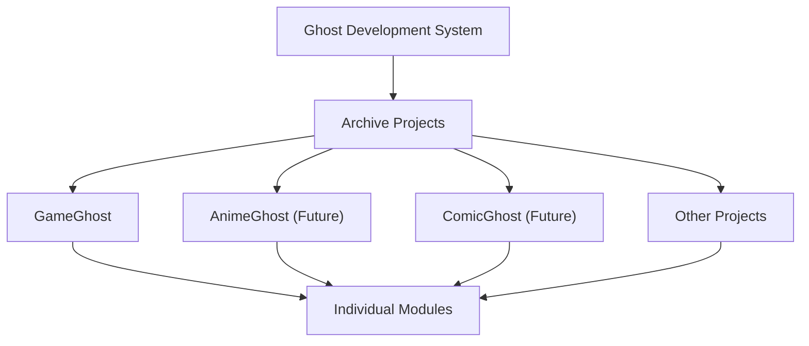

# Responsibility Boundary

## Purpose

This document defines the main ownership boundaries in the Ghost Development
System.

Clear boundaries help humans and AI decide where a feature, document, workflow,
or future candidate belongs.

## DevelopmentSystem

DevelopmentSystem owns archive-wide development infrastructure.

Responsibilities:

- Workflow.
- Queue.
- Review.
- Documentation.
- Templates.
- Database Utility Framework.
- Release Coordination.
- Backup Coordination.
- Archive Target Registry.
- Health.
- Command Center.
- DMS.

DevelopmentSystem does not own module-specific business logic, module schema
content, or module import rules.

DevelopmentSystem is the parent development foundation for multiple projects.
It may define shared workflow, documentation, rules, templates, AI
collaboration, and cross-project coordination. It must not silently take over a
child project's runtime responsibilities.

## Project Hierarchy

Ghost Development System defines shared development infrastructure.

Archive Projects own project-specific direction and runtime behavior.

Individual Modules own module-specific business logic, schema, metadata, and
import rules.

## Gray Ghost Core

Gray Ghost Core owns:

- Analysis.
- Recommendation.
- Cross-module Intelligence.

Gray Ghost Core may compare modules, detect patterns, and recommend action. It
does not replace module ownership or human approval.

## Archive Modules

Archive Modules own:

- Business Logic.
- Schema.
- Metadata.
- Import Rules.

Examples of Archive Modules may include GameGhost and future modules.

Module-specific behavior should stay in the module unless repeated use proves it
belongs in DevelopmentSystem or Gray Ghost Core.

Examples of future or related projects may include:

- GameGhost.
- AnimeGhost.
- ComicGhost.
- Other.

Each project should keep its own runtime ownership unless a later reviewed Q
promotes shared behavior into Ghost Development System.

## Launcher

Launcher owns:

- User Entry Point.

Launcher may route users to tools and archive targets. It should not own DMS,
workflow, module business logic, or database utility frameworks.

## Database Philosophy

DevelopmentSystem owns Database Utility.

Database Utility may include:

- import and export assistance;
- validation helpers;
- backup coordination;
- migration assistance;
- schema helper tooling;
- database quality reporting;
- cross-module health checks.

Archive Modules own Schema Ownership.

Schema Ownership includes:

- schema definitions;
- metadata rules;
- import rules;
- module-specific data contracts;
- business logic that interprets module data.

## Boundary Review Checklist

Before accepting a new feature or document, ask:

- Is this development infrastructure?
- Is this cross-module analysis or recommendation?
- Is this module-specific business logic?
- Is this only a user entry point?
- Does this require Human Approval Gate?
- Is this a Future Candidate rather than approved scope?
- What is the Target Project?
- Does this Q have Cross Project Impact?
