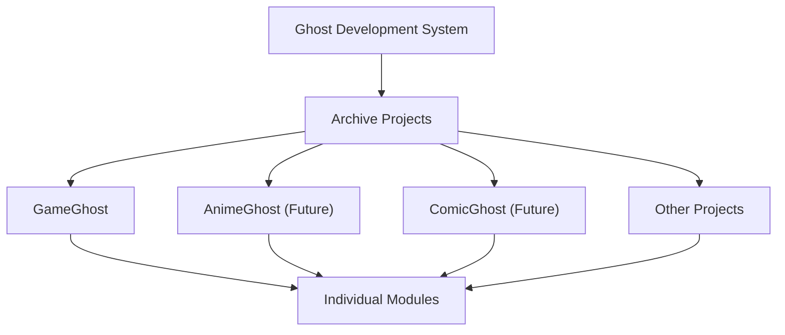

# Responsibility Boundary

## Purpose

This document defines the main ownership boundaries in the Ghost Development
System.

Clear boundaries help humans and AI decide where a feature, document, workflow,
or future candidate belongs.

## DevelopmentSystem

DevelopmentSystem owns archive-wide development infrastructure.

Responsibilities:

- Workflow.
- Queue.
- Review.
- Documentation.
- Templates.
- Knowledge Asset Layer.
- Metrics Layer.
- Database Utility Framework.
- Release Coordination.
- Backup Coordination.
- Archive Target Registry.
- Health.
- Command Center.
- DMS.

DevelopmentSystem does not own module-specific business logic, module schema
content, or module import rules.

DevelopmentSystem is the parent development foundation for multiple projects.
It may define shared workflow, documentation, rules, templates, AI
collaboration, and cross-project coordination. It must not silently take over a
child project's runtime responsibilities.

## Knowledge Asset Layer

Knowledge Asset Layer (KAL) owns the shared knowledge asset boundary for Ghost
series projects.

KAL responsibilities:

- define common Knowledge Asset categories;
- provide shared promotion, validation, registry, and search direction;
- separate approved knowledge from raw runtime data;
- make automation consume explicit reviewed knowledge;
- support GameGhost, AnimeGhost, ComicGhost, and future projects without taking
  over their runtime ownership.

Knowledge Asset examples:

- Approved Alias.
- Metadata.
- Unicode Rules.
- Golden Samples.
- OCR Confusion Rules.
- Review Decisions.
- Series Rules.
- Platform Rules.
- User Overrides.
- Future AI Knowledge.

KAL does not own:

- module-specific schema definitions;
- module-specific import rules;
- project-specific runtime business logic;
- final human approval authority.

Architecture flow:

```text
OCR / Import / Review Input
  -> Knowledge Asset Layer
  -> Candidate Engine
  -> Review GUI / Knowledge Editor
  -> Human Approval
  -> Knowledge Growth
```

Knowledge Editor is the editing surface for Knowledge Assets. Knowledge Assets
Dashboard is the observation surface for asset state, growth, and quality.
Neither one replaces KAL itself.

## Metrics Layer

Metrics Layer owns the shared measurement boundary for Ghost Development
System.

Purpose:

```text
Field Project
  -> Metrics Collection
  -> Knowledge
  -> Evidence
  -> Ghost Development System
```

Metrics Layer responsibilities:

- define common metric categories and meanings;
- connect metrics to reviewed artifacts, Q files, completion reports, and
  Knowledge Assets;
- separate raw operational logs from reviewed evidence;
- support Evidence Feedback Loop without bypassing Human Approval Gate;
- make Ghost Development System improvement measurable across field projects.

Metric examples:

- OCR Success Rate.
- OCR Review Rate.
- Alias Improvement.
- Unicode Improvement.
- Golden Sample Accuracy.
- Q Completion Time.
- Review Iterations.
- Duplicate Prevention.
- Documentation Reuse.
- Knowledge Promotion Count.
- Reused Knowledge Assets.
- New Knowledge Assets.
- Human Review Time.
- Automation Rate.

Metrics Layer does not own:

- project-specific runtime instrumentation;
- private operational data;
- final interpretation of quality;
- rule standardization approval;
- release decisions.

Metrics are evidence inputs. They do not automatically promote a rule,
workflow, architecture change, or automation behavior. Promotion still requires
review and, when needed, Human Approval Gate.

## Project Hierarchy



Ghost Development System defines shared development infrastructure.

Archive Projects own project-specific direction and runtime behavior.

Individual Modules own module-specific business logic, schema, metadata, and
import rules.

## Gray Ghost Core

Gray Ghost Core owns:

- Analysis.
- Recommendation.
- Cross-module Intelligence.

Gray Ghost Core may compare modules, detect patterns, and recommend action. It
does not replace module ownership or human approval.

Gray Ghost Core may recommend Knowledge Assets or detect cross-project patterns,
but approved asset ownership and promotion rules remain under KAL and Human
Approval Gate.

## Archive Modules

Archive Modules own:

- Business Logic.
- Schema.
- Metadata.
- Import Rules.

Examples of Archive Modules may include GameGhost and future modules.

Module-specific behavior should stay in the module unless repeated use proves it
belongs in DevelopmentSystem or Gray Ghost Core.

Archive Modules may provide project-owned Knowledge Assets to KAL. For example,
GameGhost may own game-specific metadata or aliases, while KAL defines how those
assets are promoted, validated, searched, and reused by shared tooling.

Examples of future or related projects may include:

- GameGhost.
- AnimeGhost.
- ComicGhost.
- Other.

Each project should keep its own runtime ownership unless a later reviewed Q
promotes shared behavior into Ghost Development System.

## Launcher

Launcher owns:

- User Entry Point.

Launcher may route users to tools and archive targets. It should not own DMS,
workflow, module business logic, or database utility frameworks.

## Command Center

Command Center owns the operational entry point for development work.

Command Center may show Knowledge Assets Dashboard, open Knowledge Editor, and
route users to review tools. It should not own Knowledge Asset definitions,
approval policy, module-specific content, or runtime schema.

Responsibility relationship:

```text
Command Center
  -> Knowledge Assets Dashboard
  -> Knowledge Editor
  -> Knowledge Asset Layer
  -> Archive Project DB / Files
```

## Database Philosophy

DevelopmentSystem owns Database Utility.

Database Utility may include:

- import and export assistance;
- validation helpers;
- backup coordination;
- migration assistance;
- schema helper tooling;
- database quality reporting;
- cross-module health checks.

Archive Modules own Schema Ownership.

Schema Ownership includes:

- schema definitions;
- metadata rules;
- import rules;
- module-specific data contracts;
- business logic that interprets module data.

CSV, JSON, and DB tables may remain internal representations for Knowledge
Assets. The long-term user-facing direction is that humans edit Knowledge
through Knowledge Editor, not raw CSV columns.

## Boundary Review Checklist

Before accepting a new feature or document, ask:

- Is this development infrastructure?
- Is this shared Knowledge Asset infrastructure?
- Is this shared Metrics Layer responsibility?
- Is this Knowledge Editor, Dashboard, or KAL responsibility?
- Is this cross-module analysis or recommendation?
- Is this module-specific business logic?
- Is this only a user entry point?
- Does this require Human Approval Gate?
- Is this a Future Candidate rather than approved scope?
- What is the Target Project?
- Does this Q have Cross Project Impact?
