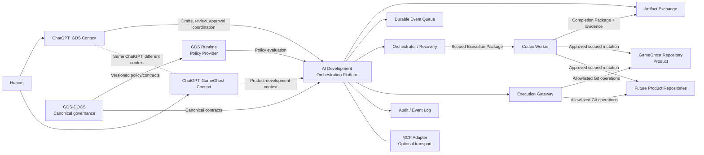

# System Context Diagram

GDS is not ChatGPT. GameGhost is not Codex. MCP is neither GDS nor GameGhost
and does not connect their product functionality. It is an optional adapter
inside the orchestration boundary.
