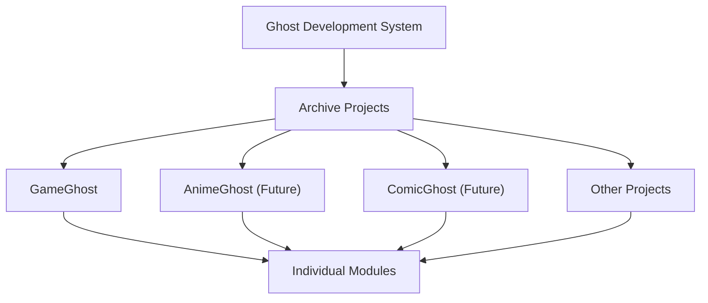

# Project Rules

**Version:** 1.0

**Last Updated:** 2026-07-01

## Purpose

この文書は、Ghost Development System が複数プロジェクトを扱うための
Project First Principle と Cross Project 管理ルールを定義します。

Ghost Development System は GameGhost だけの補助文書ではありません。
GameGhost、AnimeGhost、ComicGhost、Other など、将来の複数プロジェクトを
支える親となる開発基盤です。

## Project First Principle

すべての Q は、実装前に Target Project を宣言しなければなりません。

Target Project は、その Q がどのプロジェクトの目的、責務、成果物を扱うかを
示します。

例:

- Ghost Development System
- GameGhost
- AnimeGhost
- ComicGhost
- Other

Target Project が曖昧なまま実装してはいけません。

## Required Repository Information

すべての Q は、実装前に次の情報を確認します。

- Target Project.
- Repository.
- Working Directory.
- Documentation Root.
- Runtime Root.
- Single Source Of Truth.
- Related Repository.
- Cross Project Impact.
- Scope Guard.

Repository は編集対象の Git リポジトリを示します。

Target Project は作業対象のプロジェクト責務を示します。

この 2 つは同じとは限りません。たとえば、Ghost Development System Docs
リポジトリで GameGhost に関する参照情報を扱う場合でも、編集権限と責務範囲を
分けて書く必要があります。

## Cross Project Impact

Cross Project Impact は、現在の Q が他プロジェクトに影響するかどうかを明示
します。

推奨値:

- None: 他プロジェクトへの影響なし。
- Reference Only: 他プロジェクトを参照するが編集しない。
- Documentation Impact: 他プロジェクトの文書更新が将来必要になる可能性がある。
- Runtime Impact: 他プロジェクトの runtime に将来影響する可能性がある。
- Requires Separate Q: 別 Q と Human Approval Gate が必要。

Cross Project Impact が `None` 以外の場合、Related Repository と Scope Guard
で編集可否を明確にします。

## Parent And Project Responsibility

Ghost Development System は、各プロジェクトの親となる開発基盤です。

## Project Hierarchy

Ghost Development System は、各 Archive Project に共通する開発基盤を扱います。

Archive Projects は、それぞれの project 固有の目的、runtime、schema、metadata、
import rules、features を扱います。

Individual Modules は、各 project 内の module-specific responsibility を扱います。

Ghost Development System が扱うもの:

- Knowledge Base.
- Workflow.
- Rules.
- Templates.
- AI Collaboration.
- Architecture.
- Cross Project coordination.
- Development Platform direction.
- Command Center direction.

各プロジェクトが扱うもの:

- module-specific business logic.
- schema.
- metadata.
- import rules.
- runtime behavior.
- project-specific documentation.

親である Ghost Development System は、各プロジェクトの開発を支援します。
しかし、各プロジェクト固有の業務ロジックや runtime 実装を勝手に所有しては
いけません。

## AI Rule

AI は、Target Project、Repository、Single Source Of Truth、Scope Guard、
Cross Project Impact を確認してから編集します。

これらが欠けている、または矛盾している場合は、実装前に停止して確認します。

AI は、参照専用の関連リポジトリを編集、同期、コピー、移行してはいけません。

## Decision Background

Project First Principle の理由:

Target Project を先に宣言しないと、AI が editable repository と project
responsibility を混同し、誤編集や scope drift を起こす可能性があるため。

Cross Project Impact の理由:

Ghost Development System が複数 project の親になるほど、1 つの Q が他 project
へ与える影響を事前に分離しておく必要があるため。

## Update Policy

このルールは、複数プロジェクト運用、責務分離、Cross Project 管理の実践から
再利用可能な学びが得られたときに更新します。
